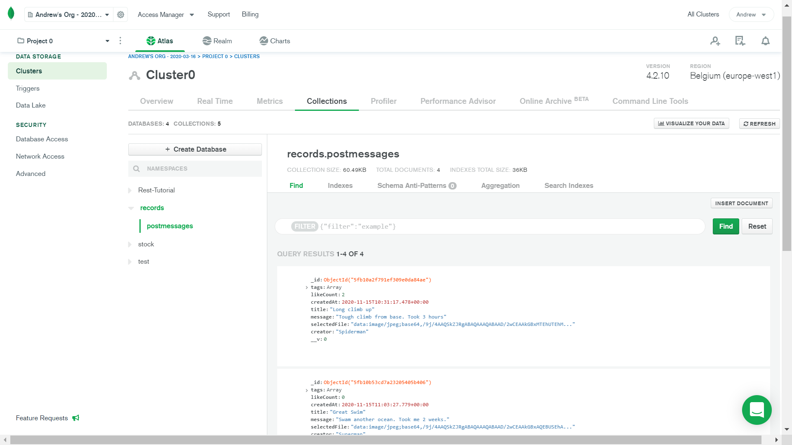

# :zap: MERN Full Stack Records

* Mongo Express React Node (MERN) full-stack app to perform CRUD operations on records
* Tutorial code from [JavaScript Mastery](https://www.youtube.com/channel/UCmXmlB4-HJytD7wek0Uo97A) with some frontend changes - see 'Inspiration' below.
* **Note:** to open web links in a new window use: _ctrl+click on link_


## :page_facing_up: Table of contents

* [:zap: MERN Full Stack Records](#zap-mern-full-stack-records)
  * [:page_facing_up: Table of contents](#page_facing_up-table-of-contents)
  * [:books: General info](#books-general-info)
    * [:books: Backend](#books-backend)
    * [:books: Frontend](#books-frontend)
  * [:camera: Screenshots](#camera-screenshots)
  * [:signal_strength: Backend Technologies](#signal_strength-backend-technologies)
  * [:signal_strength: Frontend Technologies](#signal_strength-frontend-technologies)
  * [:floppy_disk: Setup - Backend](#floppy_disk-setup---backend)
    * [:floppy_disk: Setup - Frontend](#floppy_disk-setup---frontend)
  * [:computer: Code Examples](#computer-code-examples)
  * [:cool: Backend Features](#cool-backend-features)
    * [:cool: Frontend Features](#cool-frontend-features)
  * [:clipboard: Status & To-Do List](#clipboard-status--to-do-list)
  * [:clap: Inspiration](#clap-inspiration)
  * [:envelope: Contact](#envelope-contact)

## :books: General info

### :books: Backend

* Node.js, Express & MongoDB cloud Atlas used to create the backend.

### :books: Frontend

* React frontend form to add text/image data to backend database
* Text & image data is displayed in ui-material cards
* Display is responsive: uses Material-UI [Grid](https://material-ui.com/api/grid/)
* Material-UI [makeStyles](https://material-ui.com/styles/api/#makestyles-styles-options-hook) used to link a style sheet with a function component using a hook. `Grow`
* User can add likes to a record but there is no limit on the times they can add likes - a time delay could be added, or the user ip could be used to limit likes

## :camera: Screenshots




## :signal_strength: Backend Technologies

* [Mongoose v5](https://mongoosejs.com/) object modelling for Node.js
* [npm mongodb v3](https://www.npmjs.com/package/mongodb) official MongoDB driver for Node.js
* [MongoDB Atlas](https://www.mongodb.com/cloud/atlas) NoSQL cloud database service
* [Express.js middleware v4](https://expressjs.com/): Note, as of version 4.16+, their own body-parser implementation is now included by default
* [Node.js v14](https://nodejs.org/es/)
* [Nodemon](https://www.npmjs.com/package/nodemon) npm module so backend server will automatically restart afdter code changes

## :signal_strength: Frontend Technologies

* [React framework v17](https://reactjs.org/)
* [React-Redux v7](https://react-redux.js.org/) store interaction logic, re-render only changed data
* [Redux-Thunk v2](https://www.npmjs.com/package/redux-thunk) middleware for Redux to write action creators that return an (asynchronous) function instead of an action.
* [Material-UI v4](https://www.npmjs.com/package/@material-ui/core) npm module for React components
* [Material-UI Official Site](https://material-ui.com/)
* [Bootstrap v4](https://getbootstrap.com/) component library
* [react-file-base64 v1](https://www.npmjs.com/package/react-file-base64) to convert files to base64
* [Axios v0.21.0](https://www.npmjs.com/package/axios) promise-based http client
* [SVG Backgrounds](https://www.svgbackgrounds.com/) source of custom backgrounds with compact file-size (~5KB) & supported by all modern browsers

## :floppy_disk: Setup - Backend

* Change to `/server` directory
* Install dependencies using `npm i`
* Install [nodemon](https://www.npmjs.com/package/nodemon) globally if you don't already have it
* Register with [MongoDB Atlas](www.mongodb.com), create & configure a database cluster and add cluster connection string to .env file - there is an example `.env.example` file to help.
* Run `npm start` for a dev server
* Navigate to `http://localhost:5000/`. The server will automatically reload if you change any of the source files

### :floppy_disk: Setup - Frontend

* Change to `/client` directory
* Install dependencies using `npm i`
* Run `npm start`. Frontend will open at `http://localhost:3000/`

## :computer: Code Examples

* Extract from `server/controllers/posts.js` - to delete a post. The post id is [read from the route "parameter"](https://expressjs.com/en/guide/routing.html). A check is made to verify it is a valid id. If it is valid then the post is removed using the mongoose `findByIdAndRemove()` command

```javascript
export const deletePost = async (req, res) => {
	const { id } = req.params;

	if (!mongoose.Types.ObjectId.isValid(id))
		return res.status(404).send(`No post with id: ${id}`);

	await PostMessage.findByIdAndRemove(id);

	res.json({ message: 'Post deleted successfully.' });
};
```

## :cool: Backend Features

* All data stored in collections in a mongoDB Atlas database that costs nothing to use in the free tier option. Data can be edited from the mongoDB Atlas collection or from within the React frontend

### :cool: Frontend Features

* Uses [React Hooks](https://reactjs.org/docs/hooks-intro.html)
* UI-Material cards look good.

## :clipboard: Status & To-Do List

* Status: Working. Not deployed
* To-Do: Complete tutorial to deploy app to Heroku (video 2: 1.11.10)

## :clap: Inspiration

* [Javascript Mastery: Build and Deploy a Full Stack MERN Project - React + Redux, Node, Express, MongoDB [Part 1/2]](https://www.youtube.com/watch?v=ngc9gnGgUdA&t=3589s)
* [Javascript Mastery: Build and Deploy a Full Stack MERN Project - React + Redux, Node, Express, MongoDB [Part 2/2]](https://www.youtube.com/watch?v=aibtHnbeuio&t=171s)
* [React documentation](https://reactjs.org/docs/getting-started.html)
* [REST API Tutorial website: HTTP Status Codes](https://www.restapitutorial.com/httpstatuscodes.html)

## :file_folder: License

* N/A.

## :envelope: Contact

* Repo created by [ABateman](https://github.com/AndrewJBateman), email: gomezbateman@yahoo.com
